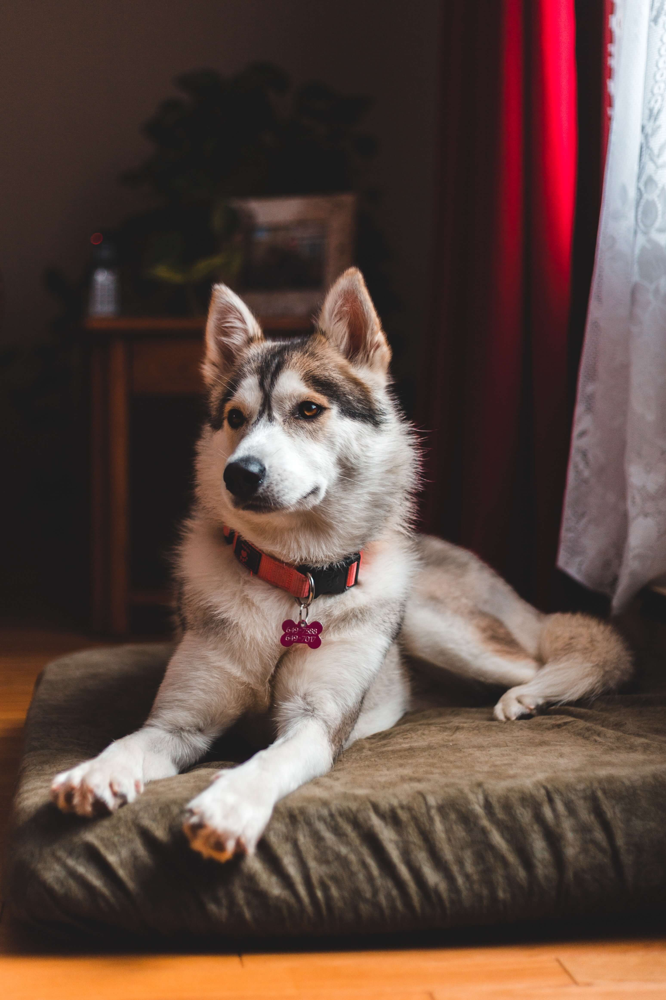
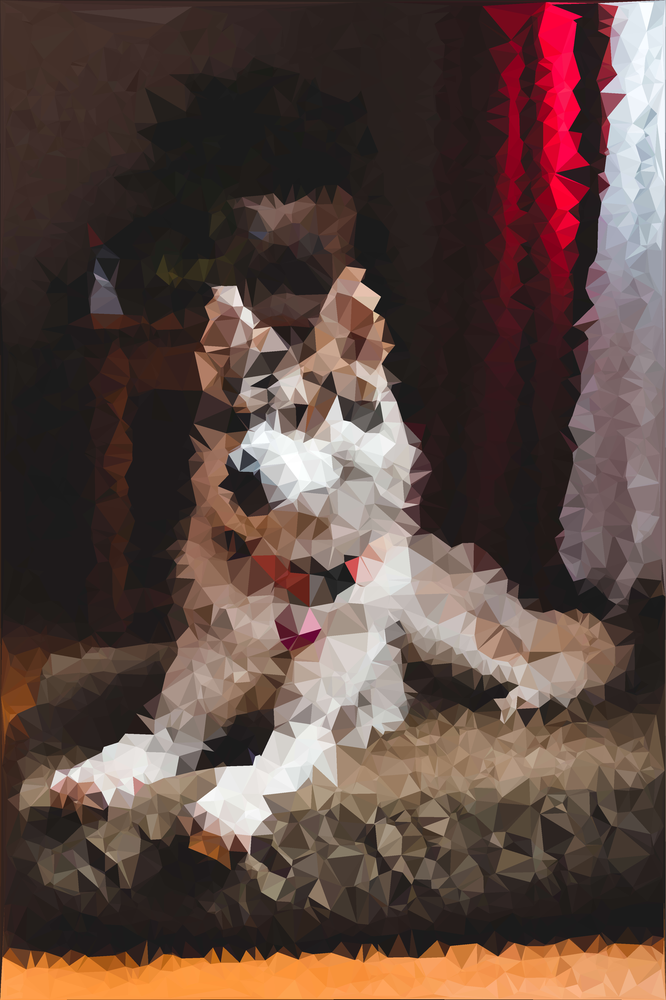
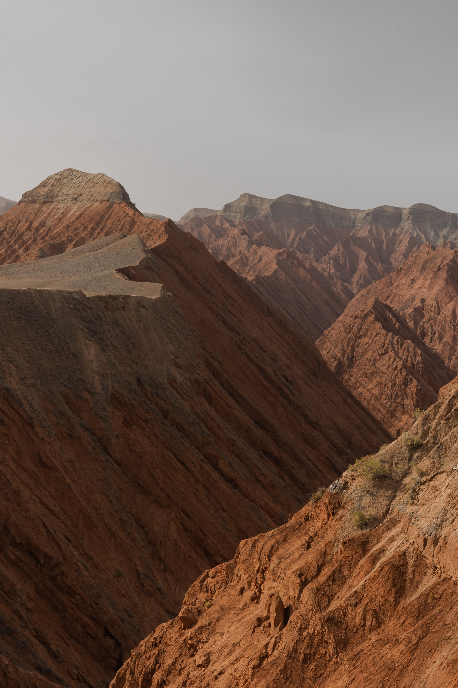
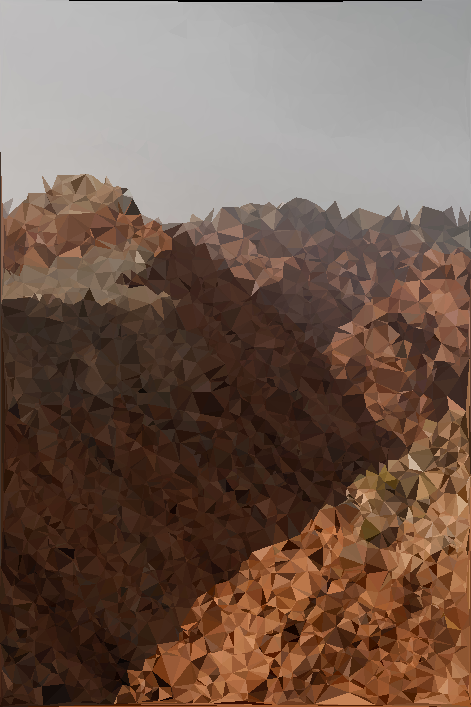
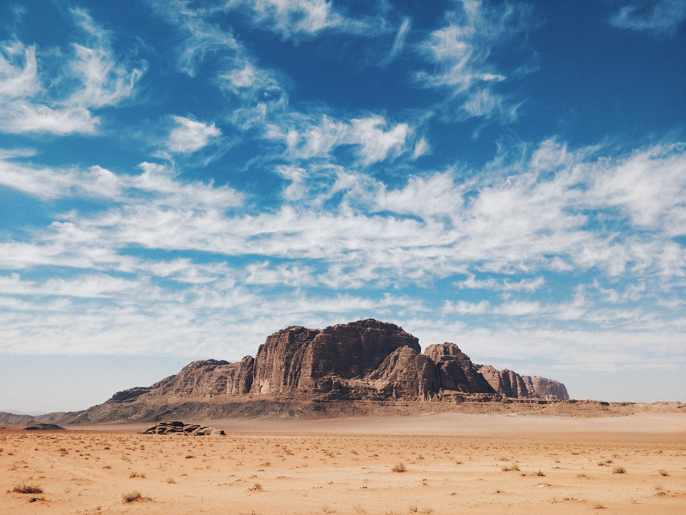
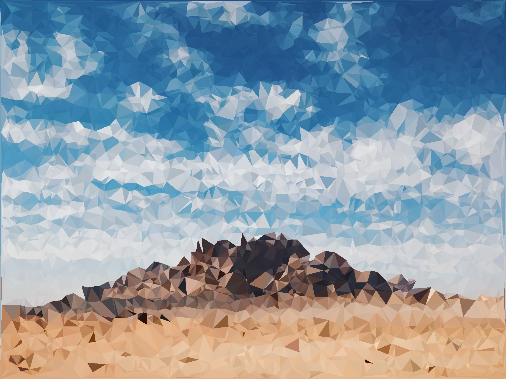

# Polify

Low-poly image generator library. Written in Rust, with some WebAssembly support. Demo [here](https://clementtsang.github.io/polify/).

## Example output

An image of a husky from [Erik Mclean](https://unsplash.com/photos/0P3M35GDyk8):

An image of some mountains by [Siyuan](https://unsplash.com/photos/6CUdZEColp0):

[More mountains, by Anton Lecock](https://unsplash.com/photos/-EJEaytR9fw)

## Thanks

- To all the photographers whose art I used for demos.

- `polify_image` algorithm heavily based on [this](https://cjqian.github.io/docs/tri_iw_paper.pdf) paper by Crystal J. Qian.
