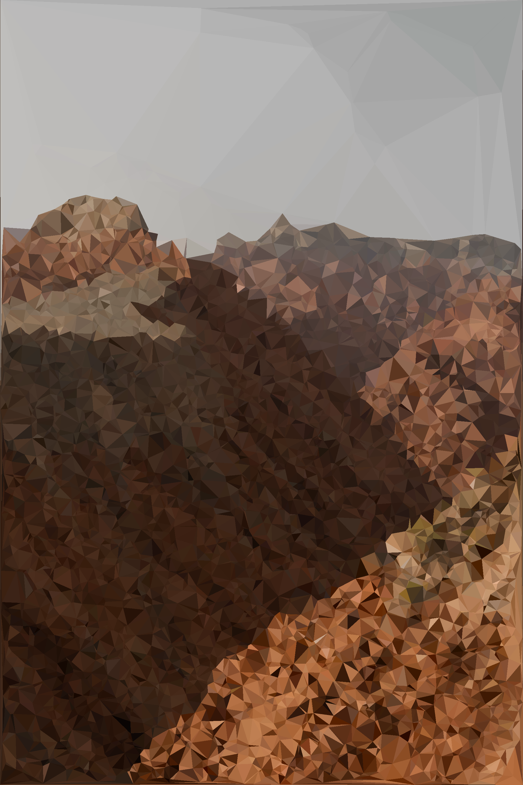

# polify

WIP

---

Low-poly image generator library. Written in Rust, compatible with WebAssembly. Try it out [here]()!

## Usage of library

If you wish to use the library, simply just import it into Cargo.toml:

```toml

```

Documentation for the library can be found [here]().

## Demo

WIP, subject to change as improvements come along!

---

An image of a husky from [Erik Mclean](https://unsplash.com/photos/0P3M35GDyk8):


An image of some mountains by [Siyuan](https://unsplash.com/photos/6CUdZEColp0):




[More mountains, by Anton Lecock](https://unsplash.com/photos/-EJEaytR9fw)


## Thanks

- To all the photographers whose art I used for demos.

- `polify_image` algorithm heavily based on [this](https://cjqian.github.io/docs/tri_iw_paper.pdf) paper by Crystal J. Qian.
