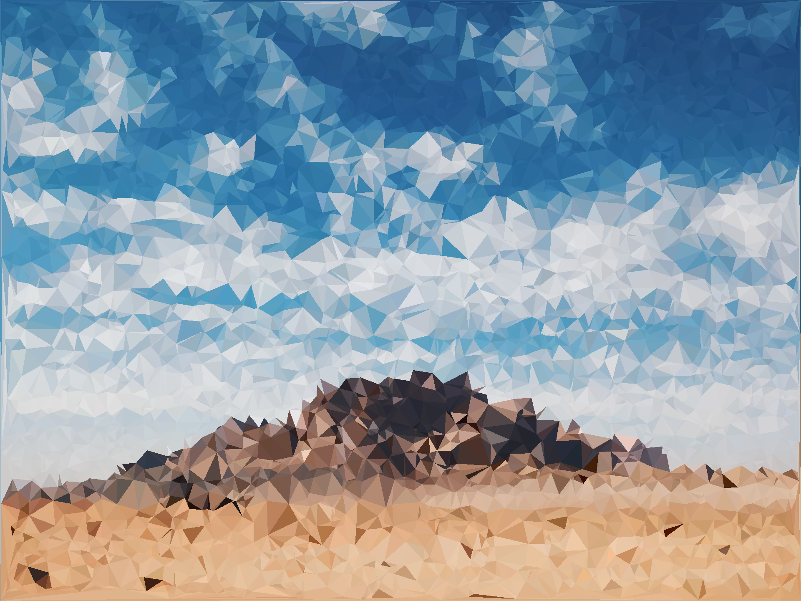

# Polify

Low-poly image generator library. Written in Rust, with some WebAssembly support. WIP demo [here](https://clementtsang.github.io/polify/).

The `polify_image` algorithm is heavily based on [this](https://cjqian.github.io/docs/tri_iw_paper.pdf) paper by Crystal J. Qian.

## Example output

Note results may be subject to change, I'm still trying to improve it, particularily the edges of triangles.

An image of a husky from [Erik Mclean](https://unsplash.com/photos/0P3M35GDyk8):


An image of some mountains by [Siyuan](https://unsplash.com/photos/6CUdZEColp0):


Another [picture of mountains, by Anton Lecock](https://unsplash.com/photos/-EJEaytR9fw):




## Usage

To generate the WASM package for use in something like NPM, use `wasm-pack`, like so:

```bash
wasm-pack build --target bundler
```

and copy the directory where needed.


## Thanks

- To all the photographers whose art I used for demos.

- Another mention of the [paper](https://cjqian.github.io/docs/tri_iw_paper.pdf) by Crystal J. Qian for the algorithm used for image generation.
